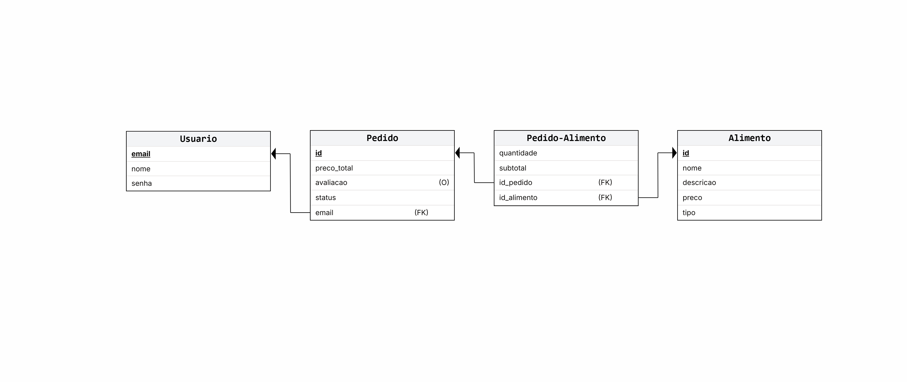

# FEIFood
CCM310 - Arquitetura de Software e Programação Orientada a Objetos

##  Visão Geral do Projeto
 
O objetivo do projeto é construir uma plataforma de pedidos de alimentos. Desenvolvido em Java, utilizando o NetBeans, banco de dados JDBC PostgreSQL, e arquitetrua MVC (Model-View-Controller).

As principais funcionalidades do sistema incluem: Cadastro e login de usuário, buscar por alimentos, listar informações de alimentos, criar, editar, excluir pedidos, permitindo adicionar e remover alimentos da

sacola livremente, avaliar pedidos cadastrados, atribuindo uma nota de até 5 estrelas.


##   Arquitetura do Sistema

   
O projeto segue o padrão de arquitetura MVC, separando os pacotes em:


- Model (M): classes de entidades


- View (V): telas de interface Swing


- Controller (C): ligação entre view e model

  
- DAO: acesso ao banco de dados


##   Estrutura / Organização

 
   ├── controller/

     ├── ControleAlimento.java

     ├── ControleCadastro.java
 
     ├── ControleHistorico.java
 
     ├── ControleLogin.java
 
     ├── ControlePedido.java
 

   ├── dao/

     ├── AlimentoDAO.java

     ├── Conexao.java
 
     ├── PedidoDAO.java

     ├── PedidoAlimentoDAO.java

     ├── UsuarioDAO.java
 

   ├── feifood/     (MAIN)

     ├──FEIFood.java

 
   ├── model/

     ├── Alimento.java

     ├── Comida.java
 
     ├── Bebida.java
 
     ├── Imposto.java
 
     ├── Pedido.java

     ├── PedidoAlimento.java
 
     ├── Usuario.java
 

   ├── view/

     ├── Cadastro.java
     
     ├── Home.java

     ├── Login.java
 
     ├── Pedidos.java
 
     ├── Sacola.java


##   Modelagem do banco de dados





##  Classes do pacote model: 

  
- Classe Usuário
  
```
public class Usuario {
    //atributos:
    private String nome, email, senha;

    //construtores: 
    public Usuario() {
    }

    public Usuario(String nome, String email, String senha) {
        this.nome = nome;
        this.email = email;
        this.senha = senha;
    }
}
```

  
- Superclasse Alimento


```
public class Alimento {
    //atributos:
    protected int idAlimento;
    protected String nome, descricao, categoria, tipo;
    protected double preco;
      
    //construtores: 
    public Alimento() {
    }

    public Alimento(int idAlimento, String nome, String descricao, String categoria, String tipo, double preco) {
        this.idAlimento = idAlimento;
        this.nome = nome;
        this.descricao = descricao;
        this.categoria = categoria;
        this.tipo = tipo;
        this.preco = preco;
    }
}
```


- Interface Imposto 

```
public interface Imposto {
    double calcularImposto();
}
````


- Subclasse Comida:  Herda todos os atributos da classe Alimento

```
public class Comida extends Alimento{

    public Comida() {
    }

    public Comida(int idAlimento, String nome, String descricao, String categoria, String tipo, double preco) {
        super(idAlimento, nome, descricao, categoria, tipo, preco);
    }
    
}
```

- Subclasse Bebida:  Herda todos os atributos da classe Alimento e implementa a interface Imposto, sobreescrevendo o método


```
public class Bebida extends Alimento implements Imposto{

    public Bebida() {
    }

    public Bebida(int idAlimento, String nome, String descricao, String categoria, String tipo, double preco) {
        super(idAlimento, nome, descricao, categoria, tipo, preco);
    }
    
    @Override
    public double calcularImposto() {
        if(categoria.equals("Álcool")){
            return preco*0.10;
        }
        return 0.00;
    }
}
```


- Classe Pedido - contém os atributos: idPedido (int), precoTotal (double), status (String), avaliacao (int), usuario (objeto da classe Usuario) e itens (ArrayList de objetos da classe PedidoAlimento),
  
também contém o método auxiliar atualizarPrecoTotal();


(os itens/alimentos de cada pedido, assim como suas respectivas quantidades e subtotais (preço unitário * quantidade), são armazenados na ArrayList<PedidoAlimento> itens, o método calcula o preço total do pedido somando o subtotal de todos os itens da ArrayList):


```
  public void atualizarPrecoTotal(){
        precoTotal = 0;
        for(PedidoAlimento i : itens){ 
            precoTotal += i.getSubtotal();
        }
    }
```


- Classe PedidoAlimento (classe intermediária que conecta as classes Pedido e Alimento) - contém os atributos: quantidade (int), subtotal (double), alimento (objeto da classe Alimento) e pedido (objeto da classe
Pedido),

também contem o método auxiliar atualizarSubtotal(), 

que calcula o subtotal multiplicando o preço unitário de um alimento pela sua quantidade,

se tiver imposto, chama o método calcularImposto() e soma o valor ao preço do alimento:


```
  public void atualizarSubtotal(){
       double precoUnitario = alimento.getPreco();
       double imposto = 0;
       if (alimento instanceof Imposto alcool){
           imposto = alcool.calcularImposto();
       }
       this.subtotal = (precoUnitario + imposto) * quantidade;
    }

```


    
- Todas as classes de entidade contém métodos get() e set() para todos os atributos;


##   Fluxo Geral do Sistema


1. Usuário faz login ou se cadastra.


2. Vê o catálogo de todos alimentos.


3. Busca alimentos.


4. Adiciona ou remove itens do pedido.


5. Subtotal, total e imposto são calculados automaticamente.


6. Finaliza o pedido.


7.  Histórico é atualizado.


8. Avalia o pedido.


